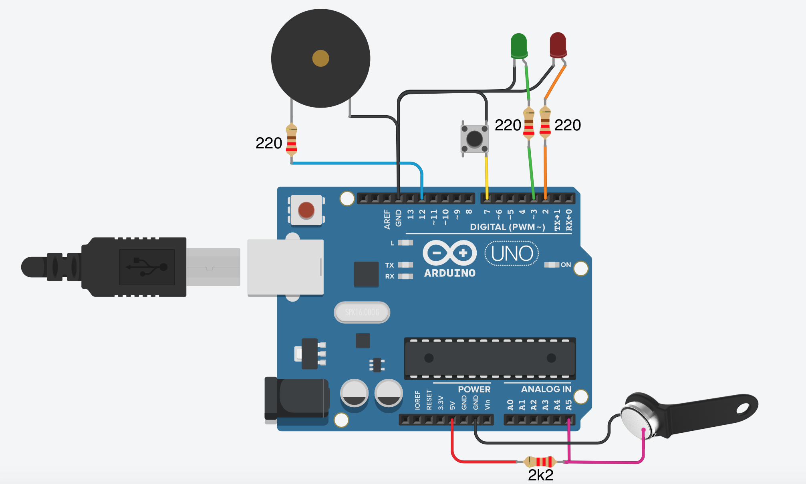

# Key Duplicator
Simple Dallas key duplicator based on arduino. 
Supports keys/buttons:
 * RW-1990.1 
 * RW-1990.2 

# Device operation
1. After power on, the GREEN LED starts blinking, waiting for the read source key.
2. Connect the source key to the socket.
    
    2.1. In case the device failed to read the key, a long beep will be reproduced. GREEN LED will continue blinking, giving a chance to try again.  
    
    2.2. If the key is recognized and successfully read, a short beep will be reproduced, and the GREEN LED will light up continuously. The device is ready for the next action (button to be pressed)
3. As soon as the button is pressed, a short beep will be reproduced, and RED LED will start blinking, awaiting for RW key (a new one). 
4. Connect the RW key to the socket, and the process will start the writing. 
   
    4.1. In case of successful key duplication, a short beep will be reproduced, otherwise, a long beep will be reproduced.
    
    Regardless of duplication results, RED LED becomes OFF. The GREEN LED will stay ON, changing the device available for the new attempt of duplication (step 3). Press the button again and make a new attempt.

Holding the button for more than 3 seconds, you will reboot the device, and you can change the source key.

# Sketch

# Requirements
* PlatformIO Core 5+
